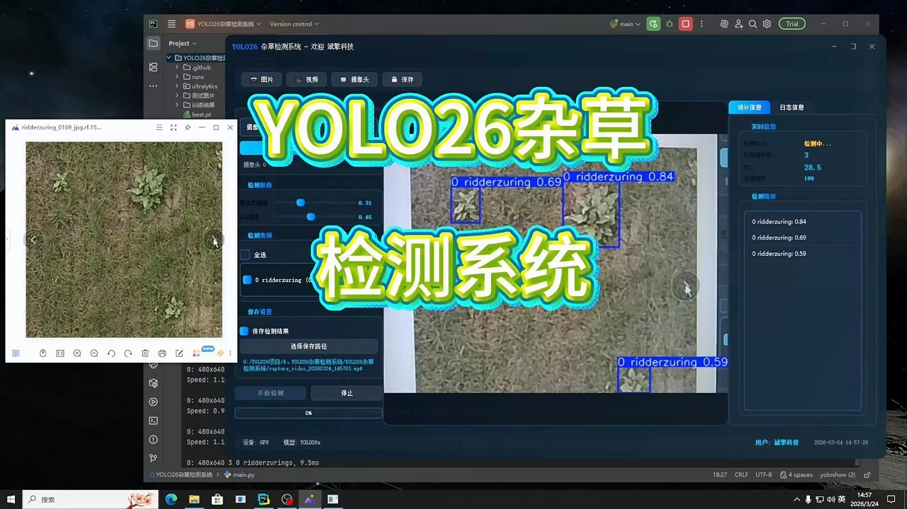
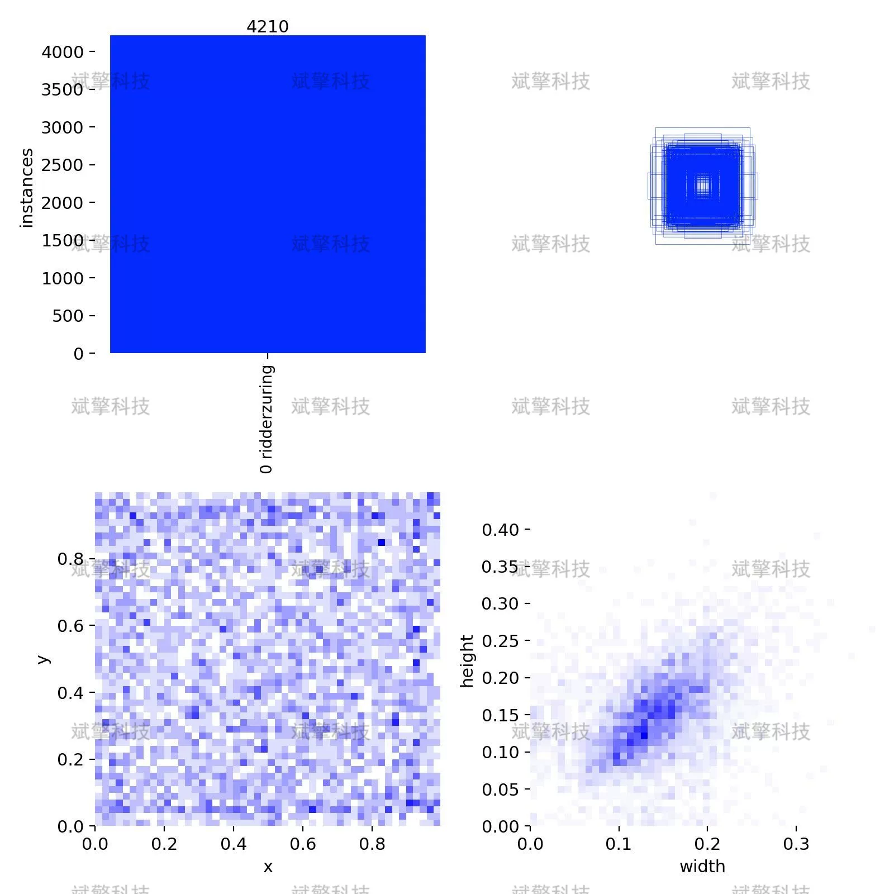
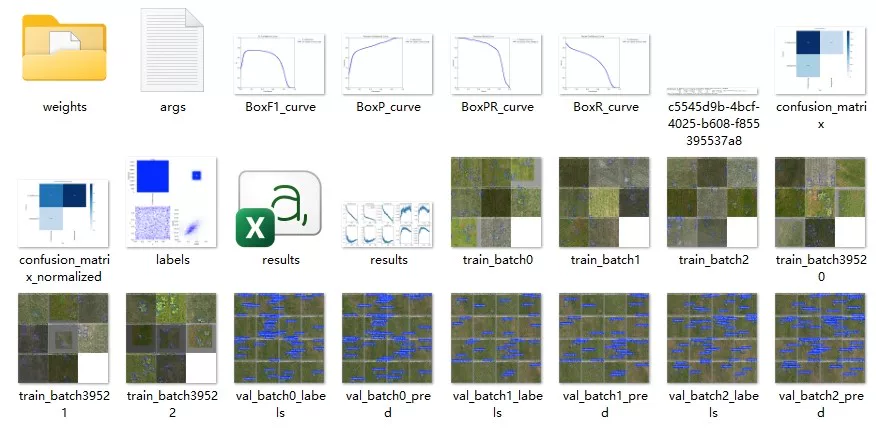
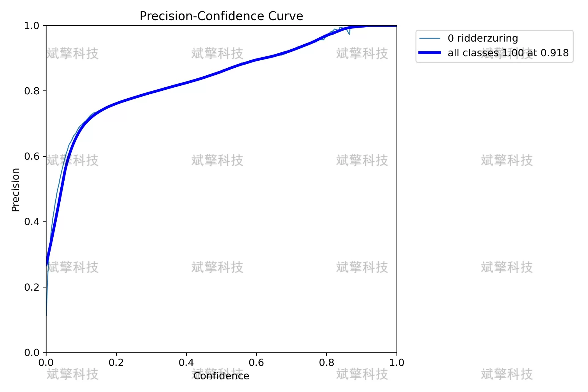
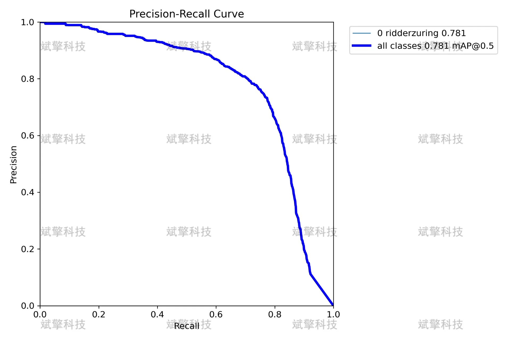
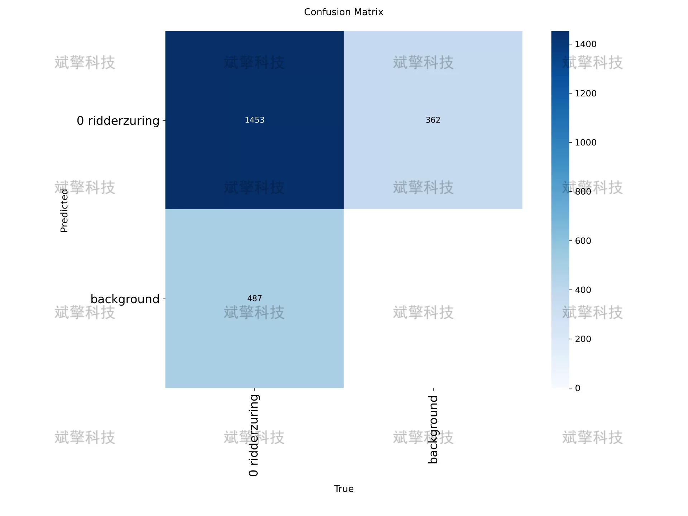
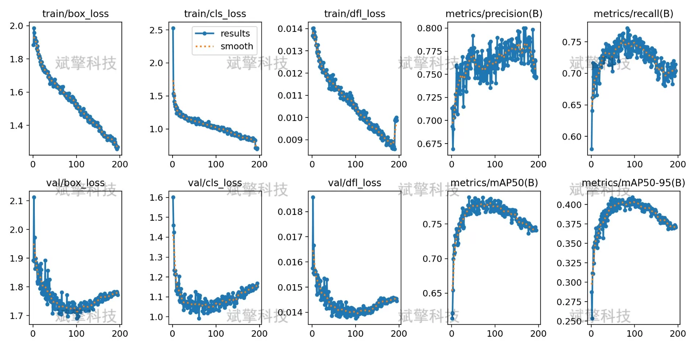
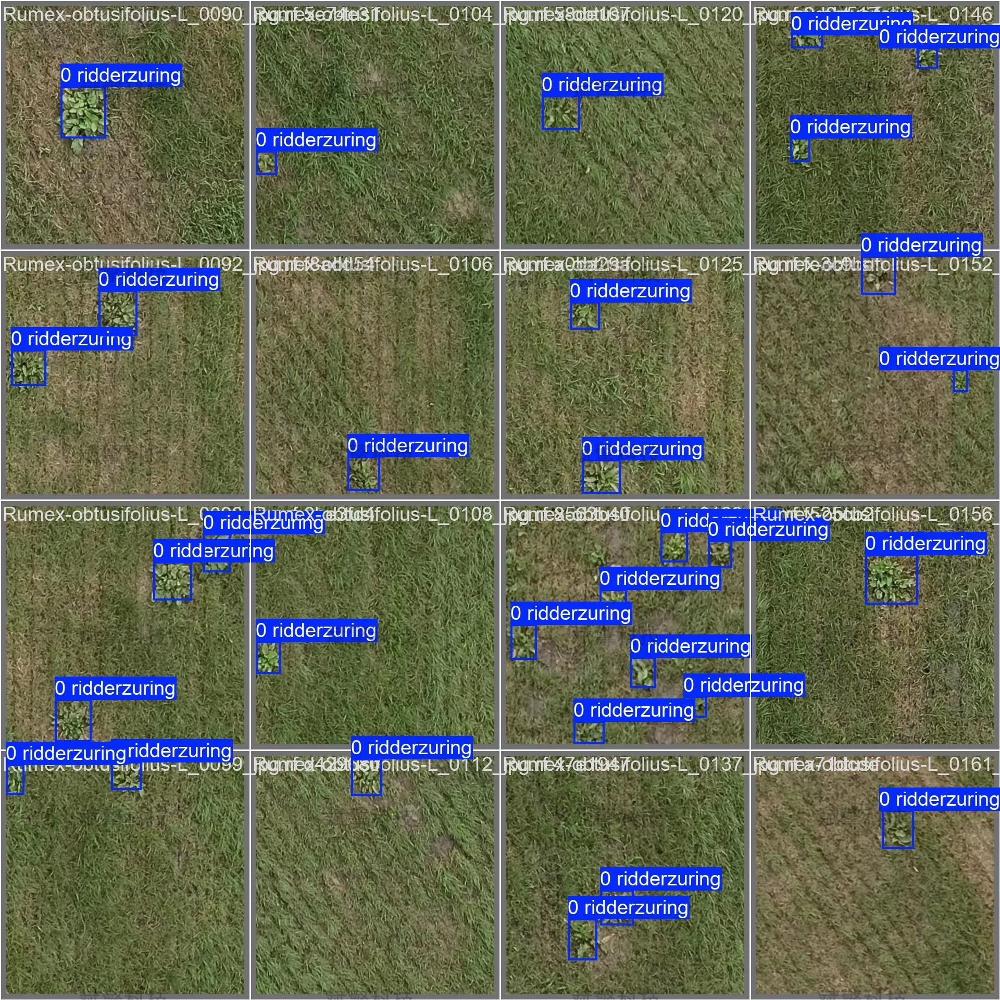
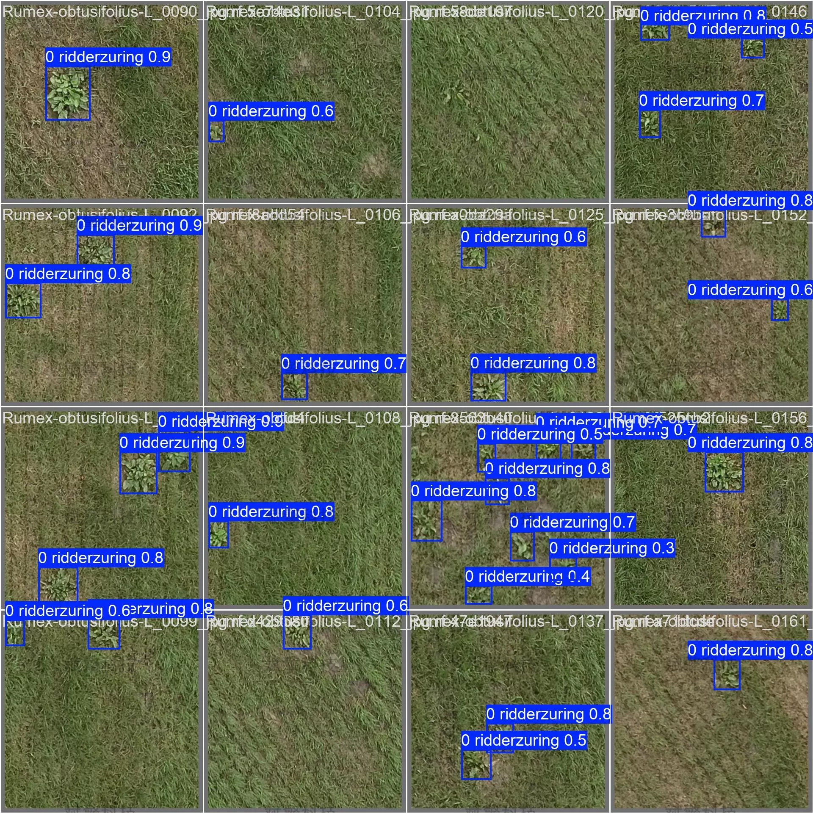

# YOLOv26 weed identification detection system | model

## Body

YOLO26 Weed Identification Detection System | Real-time Weed Detection and Precision Agriculture Decision-making System: Full Process from Dataset Construction, Model Training to Deployment

Accurate identification and localization of weeds are key technologies for achieving precise pesticide application in intelligent agriculture. This study has developed a target detection system based on the YOLO26 model for common weeds in farmlands, specifically "ridderzuring" (Amaranthus caudatus). The dataset consists of 2486 labeled images, divided into training set (1661), validation set (580), and test set (245), all labeled with the single category "0 ridderzuring". Experimental results show that the model achieves an average precision mean (mAP@0.5) of 78.1% on the validation set, with a precision of 76.4% and a recall of 74.6%. A confusion matrix analysis indicates that the model has a correct recognition rate of 75% for the target. During the training process, the loss function steadily decreases, and the model converges well, without significant overfitting. This study verifies the feasibility of YOLO26 in the task of single-class weed detection, providing strong support for subsequent field real-time detection and precision pesticide application systems.

Number of categories (nc): 1 class
Category name: ['0 ridderzuring']
Total number of images: 2486
Splitting method:
Training set: 1661 images (about 66.8%)
Validation set: 580 images (about 23.3%)
Test set: 245 images (about 9.9%)

Free reservation for remote installation. Unsuccessful full refund.
Purchase comes with the following resources (Baidu Drive automatically unlocks):
- YOLO Identification Detection Project complete source code
- YOLO format datasets
- Training code + UI interface code
- Trained model + result images
- Software installation package
- Add WeChat reservation for remote installation (Automatically display WeChat ID after purchase) - Unsuccessful, full refund

⚙️ Core functional modules
Detection capability
- Image detection: upload and check immediately, return detection boxes + category information
- Video detection: supports video files, analyzes frames accurately
- Camera real-time detection: connects to USB camera, realizes dynamic monitoring
Interaction and control
- Target selection: freely choose one or more categories for detection
- Parameter adjustment: adjustable confidence threshold & IoU threshold, flexibly control accuracy
- Results saving: save images/video/camera detection results in one click
System and data
- User login registration: Supports password strength detection + encryption storage
- Log recording: automatically records operation and error information (timestamped)

## Images

## Payment

Here is a pay link on Stripe ( https://buy.stripe.com/3cs8yP7sY87d0vu9AB ). Please contact me lonlonago@foxmail.com after funding $89, and I will send you a complete data files , thank you!

